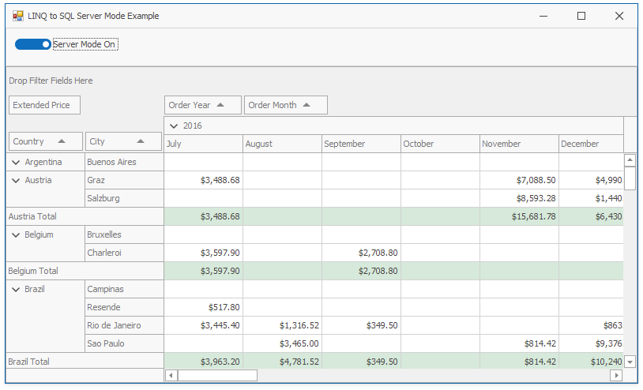
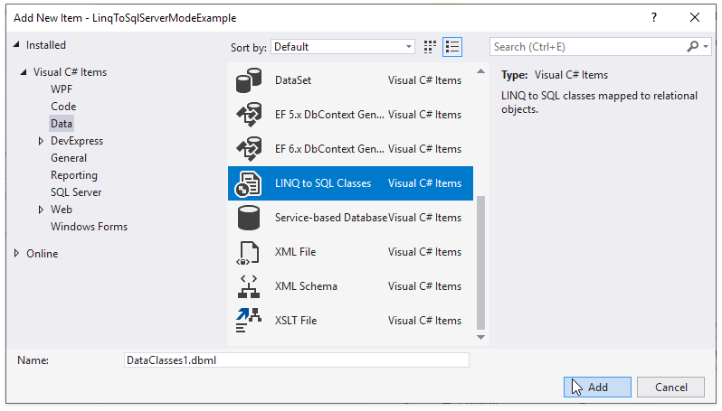
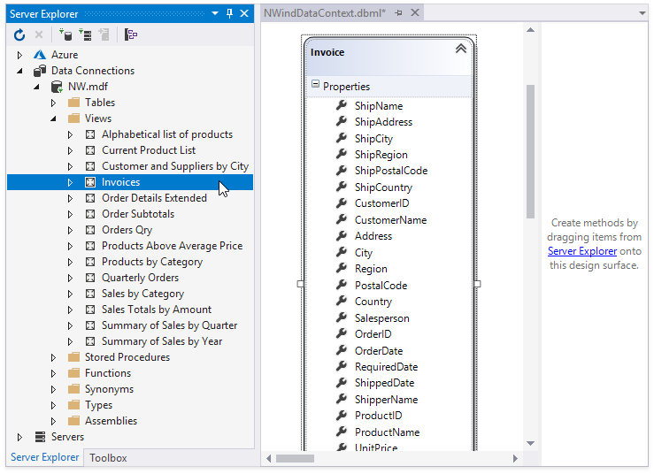
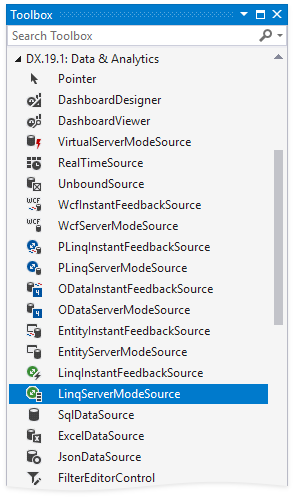

<!-- default badges list -->

<!-- default badges end -->
# PivotGridControl and LINQ to SQL - a Server Mode Example

This example demonstrates the PivotGridControl that is bound to LINQ to SQL classes and operates in Server mode.

The application contains two data sources bound to the Microsoft SQL database file:

* [LinqServerModeSource](https://docs.devexpress.com/CoreLibraries/DevExpress.Data.Linq.LinqServerModeSource)
* [BindingSource](https://docs.microsoft.com/en-us/dotnet/api/system.windows.forms.bindingsource)

Toggle the button to the _Server Mode_ position to bind the PivotGridControl to the LinqServerModeSource instance.

> SQL queries are logged to the Output window in Visual Studio IDE, so you can see what is going on behind the scene.

## Example Overview

To use LINQ to SQL in the Pivot Grid application, do the following:

### Create Data Classes

1. Add **LINQ to SQL Classes** to the project.
	
	
2. Data classes can then be created and edited in an **Object Relational Designer (O/R Designer)**. An **O/R Designer** provides a visual design surface for creating **LINQ to SQL entity classes** and relationships based on objects in a database. To learn more, see the [Microsoft LINQ to SQL article](https://docs.microsoft.com/en-us/dotnet/framework/data/adonet/sql/linq/).
	
	You can create and map entity classes to tables and views by dragging database tables and views from **Server Explorer** onto the **O/R Designer**.
	
	
	
	Save your changes, close the **O/R Designer**, and rebuild the solution.

### Bind a Pivot Grid Control to the LinqServerModeSource component

3. Drag the **LinqServerModeSource** component and drop it onto the Form. 
	
	

	> [!Note]
	> Alternatively, you can create the [LinqServerModeSource](https://docs.devexpress.com/CoreLibraries/DevExpress.Data.Linq.LinqServerModeSource) in code at runtime.

4. Specify the following properties:

	- [LinqServerModeSource.ElementType](https://docs.devexpress.com/CoreLibraries/DevExpress.Data.Linq.LinqServerModeSource.ElementType) and [LinqServerModeSource.KeyExpression](https://docs.devexpress.com/CoreLibraries/DevExpress.Data.Linq.LinqServerModeSource.KeyExpression).
	Specify the type of objects retrieved from a data source.

	- [LinqServerModeSource.QueryableSource](https://docs.devexpress.com/CoreLibraries/DevExpress.Data.Linq.LinqServerModeSource.QueryableSource)
 	Specifies the queryable source.

	See the code: [Form1.cs](./CS/LinqToSqlServerModeExample/Form1.cs#L15-L24)/[Form1.vb](./VB/LinqToSqlServerModeExample/Form1.vb#L14-L19)
	
5. Bind the Pivot Grid control to the [LinqServerModeSource](https://docs.devexpress.com/CoreLibraries/DevExpress.Data.Linq.LinqServerModeSource) component.

6. Run the project. The PivotGridControl works in server mode because it is bound to the LINQ-to-SQL data source. You can see the generated SQL statements in the Visual Studio Output window.

## Documentation
* [LINQ to SQL](https://docs.microsoft.com/dotnet/framework/data/adonet/sql/linq/)
* [Server Mode](https://docs.devexpress.com/WindowsForms/17856/controls-and-libraries/pivot-grid/binding-to-data/database-server-mode)
